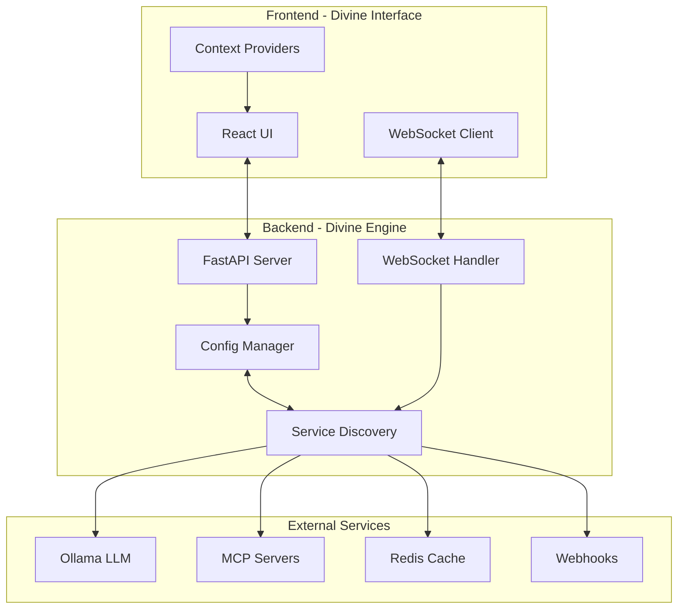

# Olympian AI Architecture

## 🏛️ System Overview

Olympian AI is a sophisticated AI orchestration platform with dynamic service discovery and configuration management. The system follows a microservices architecture with real-time communication capabilities.

## 🏗️ High-Level Architecture



## 🔧 Core Components

### 1. Service Discovery Engine

**Purpose**: Automatically discovers and configures available services

**Key Features**:
- Network scanning for known services
- Service fingerprinting and capability detection
- Health monitoring and auto-recovery
- Dynamic configuration generation

**Implementation**:
```python
class ServiceDiscoveryEngine:
    - discover_ollama_instances()
    - discover_mcp_servers()
    - discover_redis_instances()
    - discover_webhook_opportunities()
    - scan_system_resources()
```

### 2. Dynamic Configuration Management

**Purpose**: Manages configuration that adapts to discovered services

**Key Components**:
- `DiscoveredServices`: Runtime service registry
- `UserPreferences`: Persistent user settings
- `ActiveServices`: Currently active service instances

**Configuration Flow**:
1. Service Discovery finds services
2. Configuration Manager updates settings
3. WebSocket broadcasts changes to clients
4. UI reflects new configuration

### 3. WebSocket Communication Layer

**Purpose**: Real-time bidirectional communication

**Message Types**:
- `chat`: AI conversation messages
- `config_update`: Configuration changes
- `service_discovery`: Discovery events
- `project`: Project management
- `generation`: Content generation requests
- `system`: System status updates

**Connection Management**:
- Automatic reconnection with exponential backoff
- Message queuing during disconnection
- Client state synchronization

### 4. Ollama Integration

**Purpose**: LLM inference and model management

**Features**:
- Multi-instance support
- Model discovery and management
- Streaming response handling
- Automatic endpoint failover

### 5. MCP (Model Context Protocol) Integration

**Purpose**: Extensible tool system for AI capabilities

**Supported Servers**:
- Filesystem operations
- Git repository management
- GitHub API integration
- Custom tool implementations

## 📊 Data Flow

### 1. Service Discovery Flow

```
1. Startup/Periodic Scan Triggered
2. ServiceDiscoveryEngine scans network
3. Services detected and validated
4. Capabilities introspected
5. Configuration updated
6. WebSocket broadcasts updates
7. UI reflects new services
```

### 2. Chat Message Flow

```
1. User sends message via UI
2. WebSocket transmits to backend
3. Message routed to OllamaService
4. Stream initiated with LLM
5. Chunks streamed back via WebSocket
6. UI renders progressive response
7. Conversation state updated
```

### 3. Configuration Update Flow

```
1. User modifies preferences
2. API endpoint called
3. Configuration validated
4. Settings persisted to disk
5. WebSocket notifies all clients
6. UI components re-render
```

## 🛡️ Security Architecture

### Authentication & Authorization

- JWT-based authentication
- Role-based access control (RBAC)
- API key management for services

### Network Security

- CORS policy enforcement
- Rate limiting with auto-adjustment
- Webhook signature verification
- Service-specific authentication

### Data Protection

- Encrypted configuration storage
- Secure WebSocket connections (WSS)
- Input validation and sanitization
- Sandboxed execution environments

## 📦 State Management

### Frontend State

**React Context Providers**:
- `WebSocketContext`: Connection and messaging
- `ConfigContext`: Service configuration
- `ThemeContext`: UI theming

**Local State**:
- Component-specific state with hooks
- Form state management
- UI interaction state

### Backend State

**In-Memory State**:
- Active WebSocket connections
- Service health status
- Discovery results cache

**Persistent State**:
- Configuration (YAML files)
- Project data (filesystem)
- Conversation history (in-memory/Redis)

## 🚀 Scalability Considerations

### Horizontal Scaling

- Stateless API design
- Redis for shared state
- Load balancer compatibility
- Service mesh readiness

### Resource Optimization

- Connection pooling
- Lazy service initialization
- Automatic resource limits
- Graceful degradation

### Performance Optimizations

- Efficient WebSocket message batching
- Service discovery caching
- Debounced configuration updates
- Progressive UI rendering

## 🔄 Deployment Architecture

### Development

```
Local Machine
├── Backend (uvicorn --reload)
├── Frontend (vite dev server)
├── Ollama (local instance)
└── Redis (Docker container)
```

### Production

```
Kubernetes Cluster
├── Backend Pods (3 replicas)
├── Frontend (Nginx)
├── Redis (Cluster mode)
├── Ingress Controller
└── Service Mesh (optional)
```

### Docker Compose

```
Docker Network
├── backend (FastAPI)
├── frontend (Nginx)
├── redis (Alpine)
├── ollama (GPU support)
└── mcp-servers (optional)
```

## 🎯 Future Architecture Considerations

### Planned Enhancements

1. **Plugin System**
   - Dynamic plugin loading
   - Plugin marketplace
   - Sandboxed execution

2. **Multi-Tenancy**
   - User isolation
   - Resource quotas
   - Tenant-specific services

3. **Federation**
   - Cross-instance communication
   - Shared model registry
   - Distributed inference

4. **Advanced Monitoring**
   - Distributed tracing
   - Metrics aggregation
   - AI performance analytics

---

This architecture ensures Olympian AI remains scalable, maintainable, and extensible while providing a divine user experience. ⚡